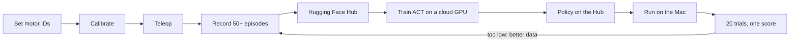

# arm

LeRobot tooling for a pair of SO-101 arms (leader and follower) on a Mac mini M4. Setup, calibration, teleop, dataset recording and cloud training. Nothing here moves a motor without a person at the desk with the e-stop in reach.

Pinned: LeRobot 0.6.1, Python 3.12, torch 2.11 (MPS). See `requirements.lock`.

## How it fits together



Six diagrams with notes on what to learn from each: [docs/architecture.md](docs/architecture.md). Hardware wiring, the joint chain and motor IDs, what a recorded frame holds, what the policy does at run time.

## Install

Tested on macOS 26.5, Apple Silicon. Takes about 5 minutes on a normal connection.

```bash
brew install uv ffmpeg@8
git clone <this repo> arm
cd arm
uv venv --python 3.12 .venv
uv pip install --python .venv/bin/python -r requirements.lock
cp .env.example .env
source scripts/env.sh
python -c "import lerobot, torch; print(lerobot.__version__, torch.backends.mps.is_available())"
```

Expected last line: `0.6.1 True`.

Why ffmpeg@8 and not ffmpeg: torchcodec 0.11 (the video decoder LeRobot uses) supports ffmpeg 4 to 8 only. `scripts/env.sh` points the dynamic loader at ffmpeg@8. Always `source scripts/env.sh` in a new terminal before any `lerobot-*` command, or run the wrappers in `scripts/`, which source it for you.

First camera run: macOS will ask for camera access. Allow your terminal app under System Settings, Privacy & Security, Camera. If you said no once, turn it on there and restart the terminal.

## Ports

Each Waveshare driver board shows up as a USB serial port. Find them one board at a time:

```bash
source scripts/env.sh
lerobot-find-port
```

It asks you to unplug the board and press Enter, then prints the port. Write the two ports into `.env` as `FOLLOWER_PORT` and `LEADER_PORT`. The tool has no `--help` flag in LeRobot 0.6.1; running it starts the interactive prompt straight away.

## Cameras

Two cameras, both at 640x480, 30 fps: `scene` (USB webcam, fixed) and `wrist` (Waveshare IMX179 on the gripper).

```bash
lerobot-find-cameras opencv
```

Camera indexes can change after a replug on macOS. `scripts/check_cameras.py` finds each camera by name and rewrites `config/cameras.yaml`. Run it at the start of every session.

## Calibrate

Motor IDs first, one motor plugged in at a time, then calibration. Full procedure with the mistakes to avoid: `docs/calibration.md`.

```bash
lerobot-setup-motors --robot.type=so101_follower --robot.port=$FOLLOWER_PORT
lerobot-setup-motors --teleop.type=so101_leader --teleop.port=$LEADER_PORT
lerobot-calibrate --robot.type=so101_follower --robot.port=$FOLLOWER_PORT --robot.id=$FOLLOWER_ID
lerobot-calibrate --teleop.type=so101_leader --teleop.port=$LEADER_PORT --teleop.id=$LEADER_ID
scripts/backup_calibration.sh
```

Calibration files are backed up under `calibration_backups/<date>_<id>/` before any recalibration. Never delete one.

## Teleop

```bash
scripts/teleop.sh
```

Runs `lerobot-teleoperate` with both cameras from `config/cameras.yaml` and the live plot. It prints the full command first and refuses to run if the camera check has not passed in the last 30 minutes.

## Record

```bash
scripts/record.sh <skill> <num_episodes> "<task string>"
```

Dataset name rule: `<robot>_<skill>_v<N>`, for example `so101_block_to_cup_v1`. Episode 20 s, reset 10 s, streaming encode, push to the Hub. Check the result with `scripts/dataset_report.py <repo_id>`.

Demo rules: start every episode with the leader at the same rest pose. Move at a steady speed. Pause half a second before the grasp and before the release. End at rest. Watch the camera windows, not the arm. If the demo fails, press the redo key.

## Train

Training runs in the cloud, not on the Mac.

```bash
scripts/train_cloud.sh <dataset> <policy_name>
scripts/train_status.sh <job>
```

Hugging Face Jobs first, RunPod as fallback. Cost per run is written in `docs/training.md`.

## Safety

Before any session: `scripts/preflight.py` and the e-stop test. Stop order: hardware e-stop, stop button, stop word, LLM stop. See `docs/estop.md`.

## Known limits

- macOS only. Linux would need a different ffmpeg path in `scripts/env.sh`.
- Camera indexes can change after a replug. Rerun `check_cameras.py`.
- `lerobot-find-port` is interactive only, no `--help`.
- Training on the Mac (MPS) is possible but slow. Not used.
- Some scripts named above are not written yet. Each one lands with its own doc and acceptance test.
