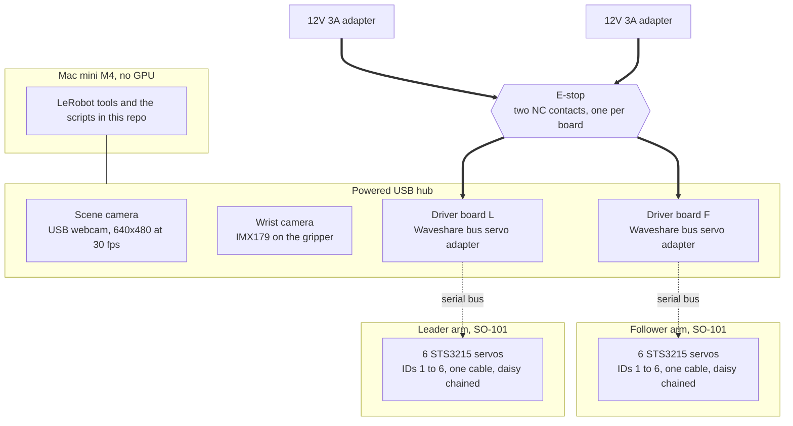
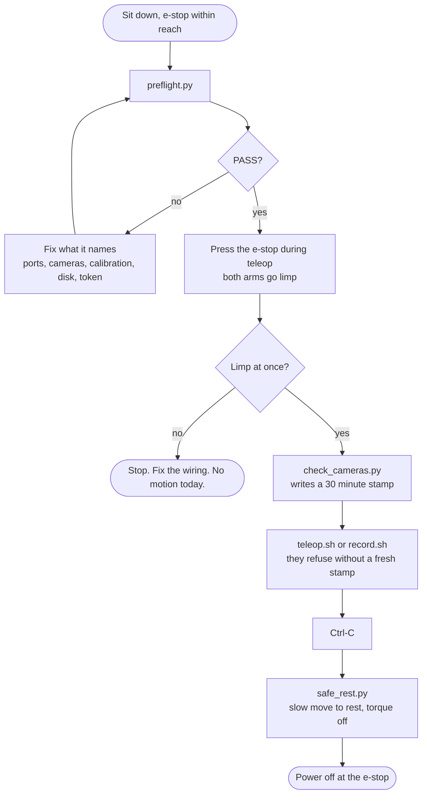
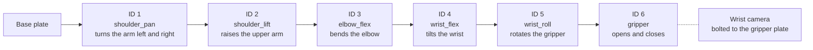
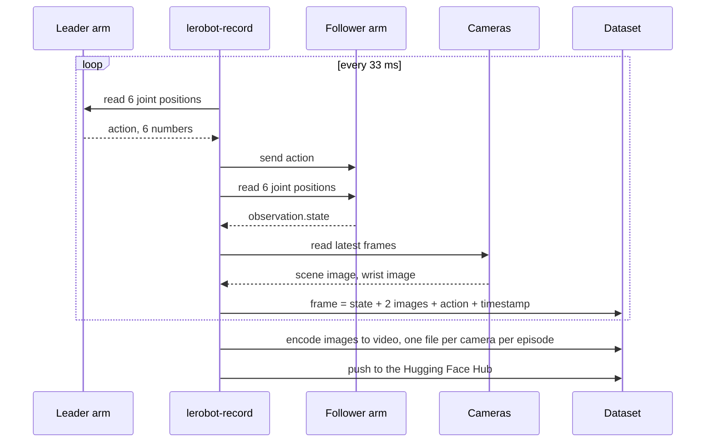
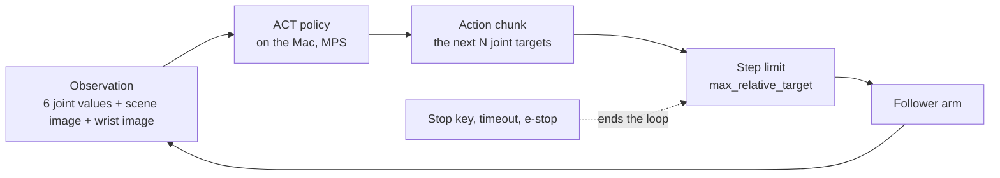

# How it fits together

Diagrams for people who want to learn from this build, not only run it. They render on GitHub. To change one, edit the text block, there are no image files.

Read them in order. Each one answers one question.

## 1. What is connected to what

Thick arrows are power. Thin arrows are data. The e-stop sits on the power side only, so the software keeps talking to the boards and can report the loss.

What to notice:

- Both arms use the same servo, the same board and the same cable. The only difference is the software role: the leader is read, the follower is driven.
- The cameras and the boards share one hub. MJPEG at 640x480 keeps two video streams inside USB 2 bandwidth. If frames drop, the fix is in `docs/usb-map.md`, not in code.
- One adapter per board. A shared adapter sags when six servos move at once.

## 2. From printed parts to a policy that runs

```mermaid
flowchart LR
    subgraph once["Once per arm"]
        ids["Set motor IDs<br>lerobot-setup-motors"] --> asm["Assemble"] --> cal["Calibrate<br>lerobot-calibrate"] --> bak["Back up calibration<br>backup_calibration.sh"]
    end

    subgraph session["Every session"]
        pre["Preflight<br>preflight.py"] --> est["E-stop test"] --> cam["Camera check<br>check_cameras.py"]
    end

    subgraph skill["Per skill"]
        tele["Teleop feasibility<br>teleop.sh, 10 tries by hand"] --> rec["Record 50+ episodes<br>record.sh"] --> rep["Dataset report<br>dataset_report.py"]
    end

    subgraph cloud["Cloud GPU"]
        train["Train ACT<br>train_cloud.sh"] --> policy["Policy on the Hub"]
    end

    subgraph eval["Back on the Mac"]
        roll["Run the policy<br>lerobot-rollout"] --> trials["20 trials under a fixed protocol"] --> score["Score, honest"]
    end

    bak --> pre
    cam --> tele
    rep -->|"push to Hub"| train
    policy --> roll
    score -->|"score too low: fix the data first"| rec
```

What to notice:

- The loop at the end goes back to recording, not to model tuning. On a small dataset, more and better demonstrations beat hyperparameters.
- Nothing is recorded for a task a human cannot do with the leader arm 8 times out of 10. If the person fails, the data will be bad.
- The Mac never trains. It collects data and runs the policy. Training is a rented GPU for a few dollars.

## 3. One session, in order

The order is the safety rule. Motors move only after preflight and the e-stop test.

What to notice:

- The camera check leaves a time stamp. The wrappers read it and refuse after 30 minutes. A tool that refuses is better than a doc that asks.
- Safe rest refuses to move if any joint is far from the rest pose. The person guides the arm closer by hand first, so the arm never sweeps across the desk on its own.

## 4. The joint chain and the motor IDs

Six motors in a chain. The ID is set into each motor before assembly and taped on. Leader and follower use the same IDs, so joint 3 on one is joint 3 on the other.

What to notice:

- A joint value is one number in degrees. The gripper is 0 to 100. Calibration maps the raw motor ticks to these numbers and stores the map in one JSON file per arm.
- The two classic mistakes are both about this chain: IDs in the wrong slots, and a calibration that did not reach both ends of a joint.

## 5. What one recorded frame holds

Recording runs a loop 30 times a second. Each pass writes one frame to the dataset.

What to notice:

- The action is where the leader is. The observation is where the follower is and what the cameras see. The policy learns to predict the next actions from the observation.
- The wrist camera is what makes grasping work. The scene camera tells the policy where things are. Drop either and the score falls.
- `dataset_report.py` reads the timestamps back and checks the loop really ran at 30 fps. Frames that arrive late are counted as drops.

## 6. What the policy does at run time

What to notice:

- ACT predicts a short chunk of future actions, not one step. That is why it moves smoothly on a small dataset.
- The step limit is a robot setting, not a policy setting. It caps how far any joint may move per step, so a confused policy moves slowly instead of fast.
- The loop runs on the Mac. Inference for ACT is light enough for the M4 without a GPU.
